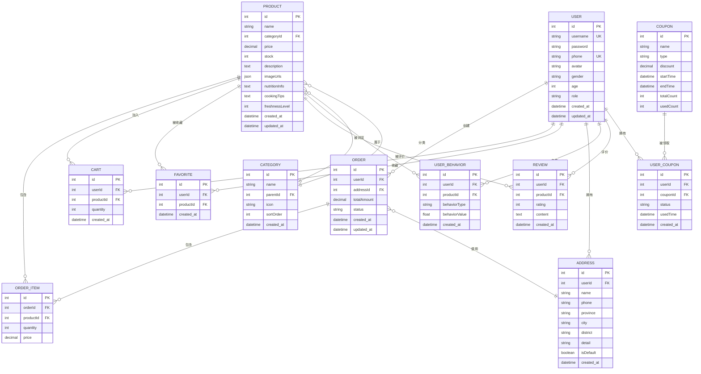

# 智能鱼类电商推荐系统 - 系统图表

本文档包含系统的用例图、架构图、ER图和重要功能流程图。

## 工具推荐

### 1. Mermaid（推荐）
- **优点**：代码生成图表，易于维护和版本控制
- **使用**：VS Code安装Mermaid插件，或使用在线编辑器 https://mermaid.live/
- **导出**：可导出为PNG、SVG格式

### 2. PlantUML
- **优点**：专业的UML工具，支持多种图表类型
- **使用**：VS Code安装PlantUML插件
- **导出**：可导出为PNG、SVG、PDF格式

### 3. Draw.io / diagrams.net
- **优点**：在线绘图工具，界面友好
- **使用**：访问 https://app.diagrams.net/
- **导出**：支持多种格式导出

### 4. Lucidchart
- **优点**：专业图表工具，模板丰富
- **使用**：在线使用，需要注册
- **导出**：支持多种格式

---

## 1. 用例图（Use Case Diagram）

### Mermaid格式

### PlantUML格式

---

## 2. 系统架构图（Architecture Diagram）

### Mermaid格式

### 分层架构图（更详细）

---

## 3. ER图（Entity Relationship Diagram）

### Mermaid格式

---

## 4. 重要功能流程图

### 4.1 图像识别流程图

### 4.2 智能推荐流程图

### 4.3 订单创建流程图

### 4.4 用户注册登录流程图

---

## 5. 推荐算法流程图（详细版）

---

## 使用说明

### 方法1：使用VS Code + Mermaid插件
1. 安装VS Code插件：`Markdown Preview Mermaid Support`
2. 打开本文档，按 `Ctrl+Shift+V` 预览
3. 右键图表可导出为PNG或SVG

### 方法2：使用在线Mermaid编辑器
1. 访问 https://mermaid.live/
2. 复制上面的Mermaid代码
3. 粘贴到编辑器中
4. 点击"Download PNG"或"Download SVG"导出

### 方法3：使用PlantUML
1. 安装VS Code插件：`PlantUML`
2. 创建`.puml`文件
3. 复制PlantUML代码
4. 按 `Alt+D` 预览
5. 右键导出为图片

### 方法4：使用Draw.io
1. 访问 https://app.diagrams.net/
2. 选择对应的图表类型
3. 手动绘制或导入模板
4. 导出为PNG、PDF等格式

---

## 图表导出建议

### 论文中使用
- **格式**：PNG（高分辨率）或SVG（矢量图）
- **分辨率**：至少300 DPI
- **大小**：根据论文排版调整

### 演示使用
- **格式**：PNG或PDF
- **分辨率**：1920x1080或更高

---

## 注意事项

1. **ER图**：确保实体关系准确，外键关系清晰
2. **流程图**：保持逻辑清晰，避免交叉过多
3. **架构图**：层次分明，模块职责明确
4. **用例图**：角色和用例关系准确

如需调整图表内容，请修改对应的代码块即可。
